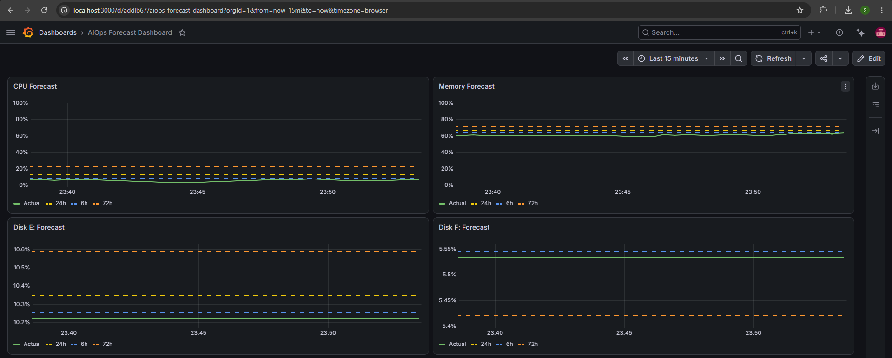

# AIOps Forecast Dashboard

Predictive monitoring for Windows host metrics. Forecasts CPU, memory, and disk usage 6/24/72 hours ahead using time-series ML, enabling alerts to fire *before* a threshold is breached rather than after.



## Why this exists

Traditional monitoring is reactive: an alert fires once CPU is already at 90%, by which point the incident is already underway. This project adds a predictive layer on top of a standard Prometheus + Grafana stack — a forecasting service that trains on historical metric data and projects future values, surfacing problems hours in advance rather than after the fact. This is the core idea behind AIOps: using ML to shift monitoring from reactive to predictive.

## Architecture

```
Windows Host (windows_exporter)
        │
        ▼
   Prometheus  ──────────────────────┐
        │                            │
        ▼                            │
  fetch_data.py (pulls history)      │
        │                            │
        ▼                            │
  forecast.py (Prophet models)       │
        │                            │
        ▼                            │
  Pushgateway  ──────────────────────┘
        │
        ▼
   Grafana Dashboard (Actual vs Forecast)
        │
        ▼
   Alertmanager (predictive alerts)
```

A cron job runs `fetch_data.py` → `forecast.py` hourly, so forecasts continuously refresh as new data comes in.

## What it monitors

| Metric | Source Query | Forecast Horizons |
|---|---|---|
| CPU usage % | `windows_cpu_time_total{mode="idle"}` | 6h / 24h / 72h |
| Memory usage % | `windows_memory_available_bytes` / `windows_memory_physical_total_bytes` | 6h / 24h / 72h |
| Disk E: usage % | `windows_logical_disk_free_bytes{volume="E:"}` | 6h / 24h / 72h |
| Disk F: usage % | `windows_logical_disk_free_bytes{volume="F:"}` | 6h / 24h / 72h |

## Tech stack

- **Metrics collection:** Prometheus + `windows_exporter`
- **Forecasting:** Python + [Prophet](https://facebook.github.io/prophet/) (Facebook's time-series forecasting library)
- **Forecast delivery:** Prometheus Pushgateway (forecasts are pushed back into Prometheus as gauges)
- **Visualization:** Grafana (actual metric vs. forecast, plotted together)
- **Automation:** cron (hourly retrain + re-forecast)
- **Alerting:** Prometheus Alertmanager (predictive alert rules based on forecasted values, not just live values)

## Setup

### Prerequisites
- Prometheus running and already scraping `windows_exporter` from the target Windows host
- Python 3.9+
- Grafana connected to the same Prometheus instance

### 1. Install dependencies
```bash
python3 -m venv venv
source venv/bin/activate
pip install prophet pandas requests prometheus-client
```

### 2. Install Pushgateway
```bash
wget https://github.com/prometheus/pushgateway/releases/download/v1.9.0/pushgateway-1.9.0.linux-amd64.tar.gz
tar xvf pushgateway-1.9.0.linux-amd64.tar.gz
cd pushgateway-1.9.0.linux-amd64
./pushgateway &
```

### 3. Add Pushgateway as a Prometheus scrape target
In `prometheus.yml`:
```yaml
scrape_configs:
  - job_name: 'pushgateway'
    honor_labels: true
    static_configs:
      - targets: ['localhost:9091']
```
Restart Prometheus to apply.

### 4. Run the pipeline manually (first time)
```bash
python fetch_data.py
python forecast.py
```

### 5. Automate with cron
```bash
crontab -e
```
Add:
```
0 * * * * cd /path/to/metric-forecaster && venv/bin/python fetch_data.py && venv/bin/python forecast.py >> forecast.log 2>&1
```

### 6. Import the Grafana dashboard
Import `dashboards/aiops-forecast-dashboard.json` in Grafana (**Dashboards → New → Import**), and map the datasource to the existing Prometheus instance.

### 7. Add predictive alert rules
Add the rules in `alerts/forecast.rules.yml` to your Prometheus `rule_files`, then reload Prometheus.

## Predictive alerting

Instead of only alerting on current state (e.g. `cpu_usage > 80`), this project alerts on the **24-hour forecast** for all four monitored metrics. The full rule set lives in `alerts/forecast.rules.yml`:

| Alert | Metric | Threshold | Severity |
|---|---|---|---|
| `CPUForecastBreach` | `cpu_forecast_pct{horizon="24h"}` | > 80% | warning |
| `MemoryForecastBreach` | `memory_forecast_pct{horizon="24h"}` | > 90% | warning |
| `DiskEForecastBreach` | `disk_e_forecast_pct{horizon="24h"}` | > 90% | critical |
| `DiskFForecastBreach` | `disk_f_forecast_pct{horizon="24h"}` | > 90% | critical |

Example (CPU):
```yaml
- alert: CPUForecastBreach
  expr: cpu_forecast_pct{horizon="24h"} > 80
  for: 10m
  labels:
    severity: warning
  annotations:
    summary: "CPU predicted to exceed 80% within 24h"
```

Each rule fires *before* the metric actually crosses its threshold — giving time to investigate or scale proactively rather than reacting after the fact.

## Model notes & a debugging story

Early versions of the CPU forecast occasionally predicted values above 100% or extrapolated a single noisy spike into an ever-increasing trend. Two fixes were required:

1. **Logistic growth overcorrected.** Bounding the model with Prophet's `growth="logistic"` (cap=100, floor=0) is designed for saturating growth curves, but on a short, noisy history it collapsed predictions toward 0% instead of producing a sensible trend.
2. **Fix: linear growth + post-hoc clipping.** Reverting to Prophet's default `growth="linear"` and clipping the output to `[0, 100]` after prediction produced a realistic, bounded forecast without destabilizing the underlying model. This illustrates why physically-bounded metrics (percentages) need either careful growth-curve selection or a validation/clipping layer, since the model has no inherent knowledge that a percentage can't exceed 100.

A separate issue arose from an initial CPU query using a 5-minute `rate()` window sampled at an identical 5-minute step, which caused the calculated rate to appear artificially flat (repeating the same value). This was resolved by sampling at a finer step (60s) than the rate window (5m).

## What would change for production / scale

- Longer training history (weeks, not hours) so Prophet can model daily/weekly seasonality instead of disabling it
- Model evaluation (MAE/RMSE against held-out data) tracked over time, with automatic fallback to a simpler baseline (e.g., moving average) if forecast error exceeds a threshold
- Multi-host support — currently scoped to a single Windows host; a production version would loop over multiple `instance` labels
- Replace cron with a proper scheduler (Airflow/Prefect) for retries, logging, and dependency management
- Store historical forecasts vs. actuals to build a forecast-accuracy dashboard over time

## Repo structure

```
.
├── fetch_data.py              # Pulls historical metrics from Prometheus
├── forecast.py                 # Trains Prophet models, pushes forecasts to Pushgateway
├── dashboards/
│   └── aiops-forecast-dashboard.json
├── alerts/
│   └── forecast.rules.yml
├── docs/
│   └── dashboard-screenshot.png
└── README.md
```

## License

MIT
